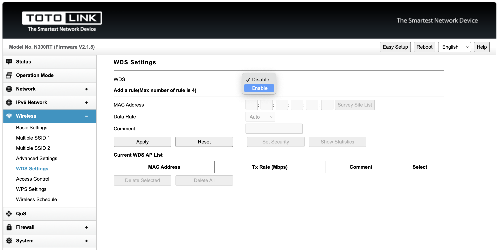
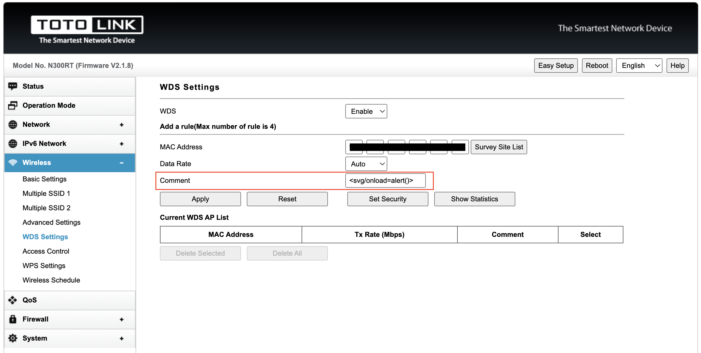

# TOTOLINK N300RT XSS Vulnerability (WDS Settings)
## Description

TOTOLINK N300RT V2.1.8-B20201030.1539 contains a Store Cross-site scripting (XSS) vulnerability in WDS Settings under the Wireless Page.

## TOTOLINK N300RT version information

- Device：TOTOLINK N300RT
- Firmware Version：V2.1.8-B20201030.1539
- Manufacturer's website information：https://www.totolink.net/ 
- Firmware download address：https://download.totolink.tw/uploads/firmware/N300RT/TOTOLINK-CX-N300RT-V2.1.8-B20201030.1539.zip

## Vulnerability information

In the settings under the "Wireless" page, there is an option called "WDS Settings". This setting allows the user to set up WDS to provide bridge traffic between two LANs through the air and extend the coverage range of a WLAN.

In the WDS Settings page, users can enable the settings. The default setting is disabled.

There is a Store Cross-site scripting vulnerability in "Comment" input box. We can simply input `<svg/onload=alert()>` to trigger the vulnerability.

After inputting the payload, the web site will execute the javascript we just inputted. This is a Store Cross-site scripting vulnerability, if someone else visits the page, the javascript will also be executed.

